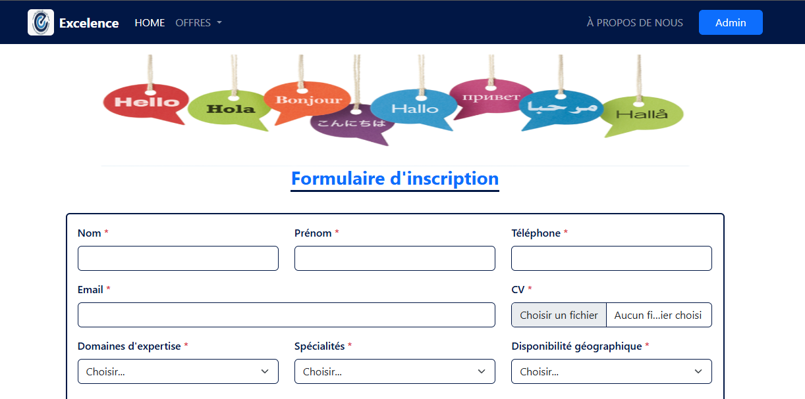
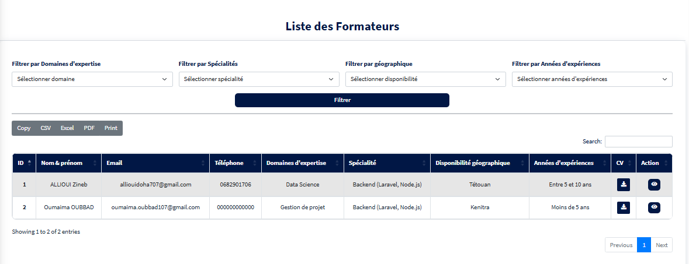
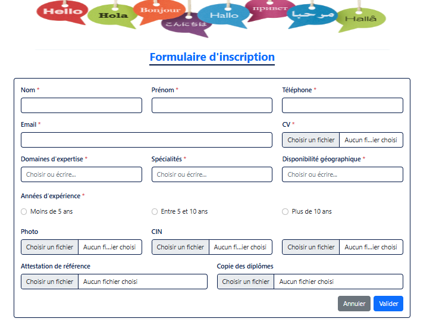
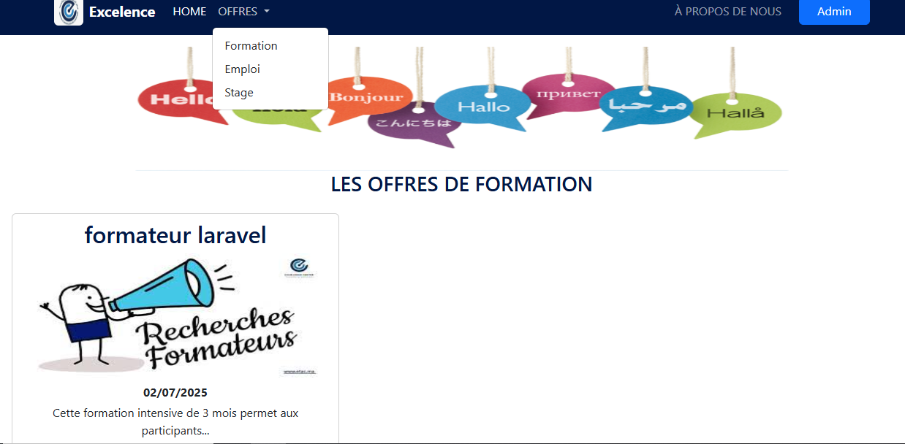
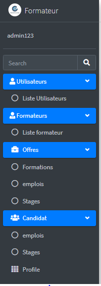

# 🎓 Gestion de Formateurs

---

## 📖 Description du projet

**Gestion de Formateurs** est une application web complète composée de deux parties complémentaires :

### 🌐 Site web pour visiteurs (formateurs et candidats)

- Inscription via un formulaire détaillé  
- Consultation des offres disponibles : formations, emplois, stages  
- Possibilité de postuler directement en ligne  
- Accès facile aux opportunités proposées par la société  

### 🛠️ Application de gestion sécurisée pour l’administrateur

- Connexion via un espace sécurisé (email + mot de passe)  
- Tableau de bord complet pour gérer le système  
- Consultation et gestion des formateurs inscrits  
- Création, modification, suppression des offres (emploi, formation, stage)  
- Suivi des candidatures reçues pour chaque offre  
- Gestion des utilisateurs (création de comptes admin, etc.)  

| Formulaire Inscription        | Liste des Offres             | Tableau de bord Admin        |
|------------------------------|-----------------------------|------------------------------|
|  |  |  |


## ⚙️ Fonctionnalités principales

- 📝 Formulaire d’inscription des formateurs  
- 📄 Consultation et postulation aux offres (formation, emploi, stage)  
- 🔐 Espace sécurisé pour l’administrateur  
- 📋 Gestion complète des formateurs  
- ✍️ Gestion des offres (création, modification, suppression)  
- 📊 Suivi des candidatures par offre  
- 👥 Gestion des utilisateurs du système  

---
## Informations administrateur

- Email par défaut : `admin@gmail.com`  
- Mot de passe par défaut : `admin1234`  
**Veuillez changer ces identifiants après la première connexion pour garantir la sécurité.**
  

  ---

## 🚀 Technologies utilisées

- 🖥️ **Laravel** (Framework PHP)  
- 🐘 **PHP**  
- 🎨 **Bootstrap** (design et responsivité)  
- 🌐 **HTML5**  
- 🎨 **CSS3**

---

## 🛠️ Installation

### Prérequis

- PHP (compatible avec Laravel)  
- Serveur web (Apache, Nginx, etc.)  
- Base de données MySQL ou équivalent  
- Composer (gestionnaire de dépendances PHP)  

### Étapes

```bash
# Cloner le dépôt
git clone https://github.com/oumaoubbad/GestionFormateurs.git

# Installer les dépendances
composer install

# Configurer la base de données dans .env (exemple)
DB_CONNECTION=mysql
DB_HOST=127.0.0.1
DB_PORT=3306
DB_DATABASE=formateur
DB_USERNAME=root
DB_PASSWORD=

# Lancer les migrations et seeders
php artisan migrate --seed

# Démarrer le serveur de développement
php artisan serve
