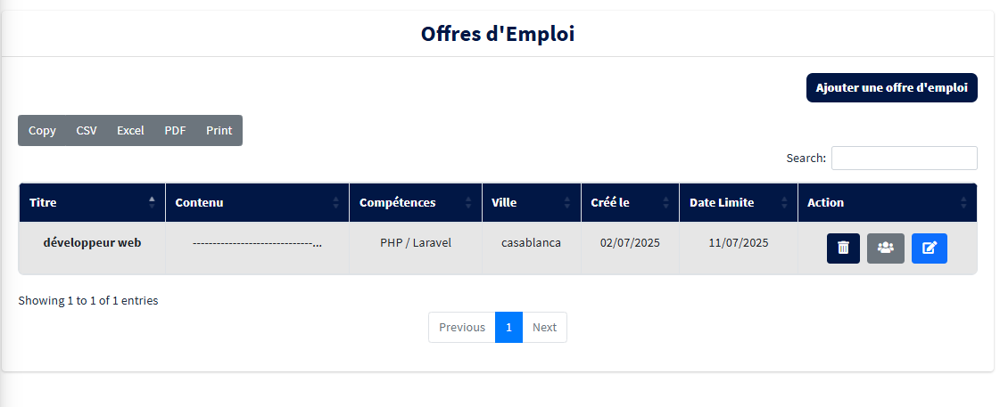

# Gestion de Formateurs

## Description du projet

Gestion de Formateurs est une application web complète composée de deux parties complémentaires :

- **Un site web accessible aux visiteurs (formateurs et candidats)** où :  
  - Les formateurs peuvent s’inscrire via un formulaire détaillé pour enregistrer leurs informations professionnelles.
  -   
  - Ils peuvent consulter les différentes offres disponibles : formations, emplois, stages.
  -  
  - Ils ont la possibilité de postuler directement en ligne aux offres qui les intéressent.
  -  

- **Une application de gestion sécurisée réservée à l’administrateur** :  
  - L’administrateur se connecte via un espace sécurisé avec un email et mot de passe.
  -   
  - Il dispose d’un tableau de bord complet pour gérer l’ensemble du système.
  -  
  - Il peut consulter la liste complète des formateurs inscrits et leurs dossiers.
  -  
  - Il peut créer, modifier ou supprimer les offres d’emploi, de formation et de stage proposées.
  -    
  - Il a accès aux candidatures reçues pour chaque offre et peut en suivre le traitement.  
  - Il peut gérer les utilisateurs du système, notamment la création de nouveaux comptes administrateurs ou autres rôles si applicable.

## Fonctionnalités principales

- Formulaire d’inscription des formateurs  
- Consultation et postulation aux offres de formation, d’emploi et de stage  
- Espace sécurisé pour l’administrateur  
- Gestion complète des formateurs inscrits  
- Gestion des offres (création, modification, suppression)  
- Suivi des candidatures par offre  
- Gestion des utilisateurs du système  

---
## Informations administrateur

- Email par défaut : `admin@gmail.com`  
- Mot de passe par défaut : `admin1234`  
**Veuillez changer ces identifiants après la première connexion pour garantir la sécurité.**

---

## Technologies utilisées

- Laravel (Framework PHP)  
- PHP  
- Bootstrap (pour le design et la responsivité)  
- HTML  
- CSS

---
